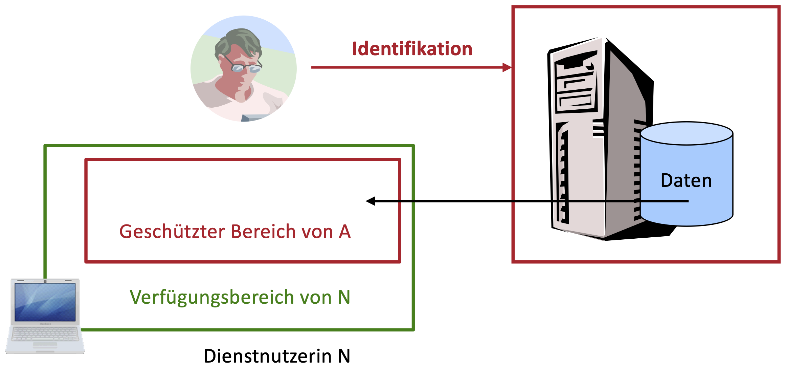
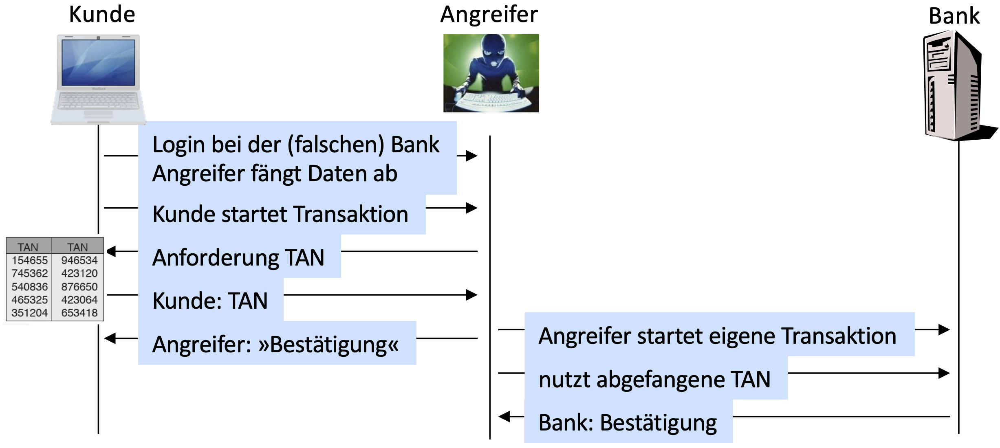

---
title: Template für Folien
author: 
- Prof. Dr. Hannes Federrath
- 12.10.2023
...

## Einführung

* Mit Markdown und Pandoc kann man sogar PowerPoint-Folien erzeugen. Im Terminal geht das so:

\ 

    pandoc --reference-doc ../TemplateSlidesPowerpoint/TemplateSlidesSVS2023.pptx -o out.pptx in.md
\ 

* Leider werden nicht alle Features unterstützt, die man von LaTeX-Beamer-Folien kennt.

## Der Arbeitsbereich Sicherheit in Verteilten Systemen (SVS)

Lorem ipsum dolor sit amet, consectetur adipisicing elit, sed do eiusmod tempor incididunt ut labore et dolore magna aliqua. Ut enim ad minim veniam, quis nostrud exercitation ullamco laboris nisi ut aliquip ex ea commodo consequat. 

* Themen
  - Privacy Enhancing Technologies (PET)
  - Security Management & Risk Management
  - Security of Mobile Systems

* Weitere Informationen
  - https://svs.informatik.uni-hamburg.de

# Zwischenfolie mit Template „Section Header“

## Gliederungsebenen

* Erste Ebene
  - Zweite Ebene
    - Dritte Ebene
  - Zweite Ebene

* Erste Ebene

1. Erste Ebene
   1. Zweite Ebene
      1. Dritte Ebene
   2. Zweite Ebene
2. Erste Ebene

## Folie mit Abbildung und Text – Template „Content with Caption“

Aus dem Pandoc User's Guide:

„This layout is used for any non-two-column slides which contain text followed by non-text (e.g. an image or a table).“

### Ziel aus Sicht eines Dienstanbieters

Einer Dienstnutzerin *N* einen Inhalt (Content) in einer bestimmten Weise zugänglich machen, ihn aber daran hindern, *alles* damit tun zu können.

## Folie mit nur einer Abbildung

## Template „Two Content“

:::::::::::::: columns
::: column

* **Attack** to detect applications in co-resident virtual machines 
  - Automatically generating signatures for individual versions and groups of versions
  - Evaluation without load and under load

:::

::: column

* **Defence** mechanism against memory deduplication side-channel attacks
  - Fake deduplication of non-duplicate pages to level out write times
  - Evaluation of performance impact
  - Evaluation of impact on side-channel effectiveness

:::
::::::::::::::

## Template „Comparison“

:::::::::::::: columns
::: column

* Two Content
  - This layout is used for two-column slides, i.e. slides containing a div with class columns which contains at least two divs with class column.

* Comparison
  - This layout is used instead of “Two Content” for any two-column slides in which at least one column contains text followed by non-text (e.g. an image or a table).

* siehe auch 
  - https://pandoc.org/MANUAL.html#powerpoint-layout-choice

:::

::: column

| Year | Low | High |
|:----:|----:|-----:|
| 1900 | -10 |   25 |
| 1910 | -15 |   30 |
| 1920 | -10 |   32 |

Dieser Text wird leider nicht angezeigt. Man sieht nur die Tabelle.

:::
::::::::::::::

## Pandoc User's Guide

* Nützliche Links
  - https://pandoc.org/MANUAL.html
  - https://pandoc.org/MANUAL.html#powerpoint-layout-choice

